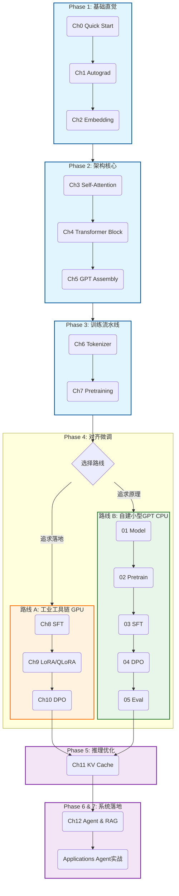

# LLM & Agent 核心技术实战教程

<p align="center">
  
  
  
  
  
  
  
</p>

<p align="center">
  <b>从 Transformer 原理 → 训练/对齐 → 推理优化 → 可运行 Agent 系统落地</b><br>
  <sub>Notebook 驱动 · 双路线可选 · 工程导向 · 强调 Agent 实战</sub>
</p>

---

## 目录

- [📌 项目定位](#-项目定位)
- [🎯 这门课适合谁](#-这门课适合谁)
- [⚡ 快速入口（Agent First）](#-快速入口agent-first)
- [🧭 路线图（双路线选择）](#-路线图双路线选择)
- [📚 章节导览（点击直达）](#-章节导览点击直达)
- [🤖 Applications：Agent 实战案例（重点）](#-applicationsagent-实战案例重点)
- [🧩 Bonus：进阶专题](#-bonus进阶专题)
- [🛠 环境配置](#-环境配置)
- [🧰 模型与技术栈](#-模型与技术栈)
- [🗂 项目结构](#-项目结构)
- [📄 License](#-license)

---

## 📌 项目定位

这是一套以 **Jupyter Notebook** 为载体的「LLM + Agent」核心技术实战教程：  
**把“黑盒大模型”拆开讲清楚，再把能力落到可运行的 Agent 工程**。

你将在短时间内获得：

- **白盒理解**：从 Autograd/Attention/Transformer 到 GPT 组装，关键机制可视化
- **训练与对齐闭环**：Pretrain → SFT → DPO（偏好对齐），同时覆盖 *工具链路线* 与 *自实现路线*
- **推理优化直觉**：KV Cache 的形状/显存/吞吐权衡
- **Agent 落地能力**：ReAct / RAG / Code Agent / Multi-Agent，可直接运行的工程案例 + 可复用后端抽象

---

## 🎯 这门课适合谁

### 适合人群

| 你是谁 | 来这里的典型目标 | 你会带走什么 |
|---|---|---|
| 工程师 / 研发 | 从“会调 API”进阶到“能评估/搭建/落地 LLM & Agent 系统” | 工业级工具链（Transformers/PEFT/TRL） + Agent 工程模板 |
| 学生 / 研究者 | 需要一套能跑通的代码库来建立直觉、验证想法 | 从零实现链路 + 透明的训练/对齐/评测过程 |
| 产品 / 数据 / 运营 | 想获得技术判断力：成本/效果/边界 | 主流技术栈与方案边界、落地模式与取舍 |

### 前置要求（尽量低门槛）

- ✅ **Python 3.8+**（推荐 Python 3.9），能运行 Notebook（Jupyter/Lab）
- ✅ 基本编程能力即可（不要求系统的 DL/数学背景）
- ➕ **推荐 NVIDIA GPU**：SFT/LoRA/DPO 等章节更顺畅（CPU 也可阅读与小规模演示）

---

## ⚡ 快速入口（Agent First）

> 如果你目标是“先跑起来，再回头补原理”，从这里开始最省时间。

| 目标 | 直接跳转 | 你会得到 |
|---|---|---|
| 本地免费跑 Agent（推荐） | [`Applications/PREPARE_OLLAMA.ipynb`](./Applications/PREPARE_OLLAMA.ipynb) → App1 | 本地 LLM 后端连通 + Agent 全流程可跑 |
| 只想看最经典 Agent 模式 | [`App1_ReAct_Agent.ipynb`](./Applications/App1_ReAct_Agent.ipynb) | Thought-Action-Observation 循环 + 工具调用 |
| 想做知识库问答（企业最常见） | [`App2_RAG_System.ipynb`](./Applications/App2_RAG_System.ipynb) | 分块/向量检索/上下文注入的 RAG 工程 |
| 想做“能写代码并执行”的智能体 | [`App3_Code_Agent.ipynb`](./Applications/App3_Code_Agent.ipynb) | 代码生成 + 安全执行 + 自修复循环 |
| 想做多角色协作 | [`App4_Multi_Agent.ipynb`](./Applications/App4_Multi_Agent.ipynb) | Planner/Coder/Reviewer/Tester 协作框架 |

---

## 🧭 路线图（双路线选择）

本教程整体结构：**基础 → 架构 → 训练 →（双路线对齐）→ 推理优化 → 系统落地 → Agent 实战**。

> 说明：Mermaid 在移动端/窄屏上可能会拥挤。我把路线图放进折叠块；你也可以直接看下方的「路线对比表」快速决策。

<details>
<summary><b>展开查看：路线图（Mermaid）</b></summary>



</details>

### 路线对比（准确硬件 & 学习收益导向）

| 维度 | 路线 A · HuggingFace 工具链 | 路线 B · 自建小型 GPT |
|:---|:---|:---|
| **核心价值** | 掌握工业级工具链，快速落地（SFT/LoRA/DPO + Agent） | 拆解训练全链路，建立底层直觉（白盒可控实验台） |
| **技术栈** | `transformers` / `peft` / `trl` | 纯 PyTorch 自实现 |
| **模型规模** | 102M（GPT-2 Chinese）→ 494M（Qwen2.5-0.5B） | ~14M（RoPE / RMSNorm / SwiGLU） |
| **硬件要求** | **建议 GPU**（尤其 DPO；**QLoRA 需要 CUDA/bitsandbytes**） | **CPU 友好**（可完整跑通） |
| **透明度** | 工具封装（灰盒） | 100% 透明（白盒，可改可复现） |
| **生产贴近度** | 高（直接可迁移到生产/团队实践） | 中低（更偏学习/实验/研究） |

#### 路线 A 的“真实运行”提示（按章节）

- **Ch8 SFT**：GPT-2 Chinese（102M）— **CPU 可跑但慢**（GPU 更舒适）  
- **Ch9 LoRA**：GPT-2 Chinese（102M）— **CPU 可跑**；**QLoRA 依赖 bitsandbytes，仅 CUDA**  
- **Ch10 DPO**：Qwen2.5-0.5B（494M）— **强烈建议 GPU**（CPU 会非常痛苦）

#### 推荐组合

两条路线相互独立，可单独完成；也可交叉学习获得更完整视角。  
**推荐节奏：先走路线 A（落地与工具链）→ 再走路线 B（白盒补全与可控对照）。**

---

## 📚 章节导览（点击直达）

### Phase 1：基础直觉（Foundations）

| 章节 | 主题 | Deliverable | Key Ideas |
|---|---|---|---|
| [**Ch0**](./Ch0_Quick_Start/Ch0_Quick_Start.ipynb) | Quick Start | 最小训练闭环（数据→loss→更新） | 训练循环、优化器、指标与可视化 |
| [**Ch1**](./Ch1_Autograd/Ch1_Autograd.ipynb) | Autograd | 手写 Micrograd / 计算图反传 | 计算图、链式法则、`backward()` 本质 |
| [**Ch2**](./Ch2_Embedding/Ch2_Embedding.ipynb) | Embedding | 训练词向量并做相似度/可视化 | 分布式语义、Embedding 检索直觉 |

### Phase 2：架构核心（Architecture）

| 章节 | 主题 | Deliverable | Key Ideas |
|---|---|---|---|
| [**Ch3**](./Ch3_Self_Attention/Ch3_Self_Attention.ipynb) | Self-Attention | Attention 前向 + mask + 权重可视化 | Q/K/V、因果 mask、注意力解释性 |
| [**Ch4**](./Ch4_Transformer_Block/Ch4_Transformer_Block.ipynb) | Transformer Block | 标准 Decoder Block 组装 | Residual、LayerNorm、FFN、dropout |
| [**Ch5**](./Ch5_GPT_Assembly/Ch5_GPT_Assembly.ipynb) | GPT Assembly | 从零组装可推理 GPT | 位置编码、采样（T/top-k/top-p） |

### Phase 3：训练流水线（Training Pipeline）

| 章节 | 主题 | Deliverable | Key Ideas |
|---|---|---|---|
| [**Ch6**](./Ch6_Tokenizer/Ch6_Tokenizer.ipynb) | Tokenizer | BPE 训练/编码/解码（含 `tiktoken`） | 词表构建、token 粒度取舍、稳定性 |
| [**Ch7**](./Ch7_Pretraining/Ch7_Pretraining.ipynb) | Pretraining | 预训练小型 GPT-2 风格基座（演示规模） | Dataset/DataLoader、Next-token、checkpoint |

### Phase 4：对齐与微调（Alignment）— 双路线

#### 路线 A：工业工具链（Transformers / PEFT / TRL）

| 章节 | 主题 | 示例基座模型 | Deliverable | Key Ideas |
|---|---|---|---|---|
| [**Ch8**](./Ch8_SFT/Ch8_SFT.ipynb) | SFT 指令微调 | `uer/gpt2-chinese-cluecorpussmall` | 指令数据格式化 + SFT 训练与对比 | Chat 模板、loss masking、对话化 |
| [**Ch9**](./Ch9_LoRA_Quantization/Ch9_LoRA_Quantization.ipynb) | LoRA /（可选）QLoRA | `uer/gpt2-chinese-cluecorpussmall` | 低资源微调（可落地） | PEFT LoRA、量化思路、显存/速度 |
| [**Ch10**](./Ch10_DPO/Ch10_DPO.ipynb) | DPO 偏好对齐 | `Qwen/Qwen2.5-0.5B-Instruct` | 偏好对齐训练 + 效果对比 | preference pair、DPO loss、TRL 实战 |

#### 路线 B：自建小型 GPT（全链路自实现）

| 章节 | 主题 | Deliverable | Key Ideas |
|---|---|---|---|
| [**01**](./Custom_GPT_Training/01_Model_Assembly.ipynb) | Model Assembly | 自建 GPT（现代组件）可跑通前向 | RoPE、RMSNorm、SwiGLU |
| [**02**](./Custom_GPT_Training/02_Pretraining.ipynb) | Pretraining | 自建模型的预训练闭环 | warmup+cosine、grad clip、日志与保存 |
| [**03**](./Custom_GPT_Training/03_SFT_Training.ipynb) | SFT Training | 自建模型的指令微调 | Chat 格式化、loss masking、自测集 |
| [**04**](./Custom_GPT_Training/04_DPO_Training.ipynb) | DPO Training | DPO 核心计算（自实现） | preference loss、reward margin 监控 |
| [**05**](./Custom_GPT_Training/05_Evaluation.ipynb) | Evaluation | Base/SFT/DPO 的评测对比 | PPL、Distinct-n、多维对比与可视化 |

### Phase 5：推理优化（Inference）

| 章节 | 主题 | Deliverable | Key Ideas |
|---|---|---|---|
| [**Ch11**](./Ch11_KV_Cache/Ch11_KV_Cache.ipynb) | KV Cache | 读懂并能解释推理加速的核心机制 | prefill/decode、KV 形状、显存/吞吐权衡 |

### Phase 6：系统落地（System）

| 章节 | 主题 | Deliverable | Key Ideas |
|---|---|---|---|
| [**Ch12**](./Ch12_Agent_RAG/Ch12_Agent_RAG.ipynb) | Agent & RAG | “能推理/能调用工具/能检索”的 Agent 原型 | ReAct、Tool Use、RAG pipeline |

---

## 🤖 Applications：Agent 实战案例（重点）

本仓库落地的核心：**基于真实 LLM 后端的可运行 Agent 应用**（优先支持本地 Ollama，同时保留 OpenAI/HF/vLLM 等扩展）。

### 统一后端抽象（可复用）

- LLM 后端抽象：`utils/llm_backend.py`（OpenAI / Ollama / HuggingFace / vLLM）
- Embedding 抽象：`utils/embedding_backend.py`（SentenceTransformers / OpenAI / HuggingFace）


### 应用列表（可直接运行）

| 应用 | 主题 | 关键能力 | 典型产出 |
|---|---|---|---|
| [**PREPARE**](./Applications/PREPARE_OLLAMA.ipynb) | Ollama Setup | 本地模型下载/连通性检查 | Agent 开箱可跑 |
| [**App1**](./Applications/App1_ReAct_Agent.ipynb) | ReAct Agent | 推理循环 + 动态工具选择 | 可行动的通用 Agent |
| [**App2**](./Applications/App2_RAG_System.ipynb) | RAG System | 分块/检索/重排/注入 | 企业知识库问答 Demo |
| [**App3**](./Applications/App3_Code_Agent.ipynb) | Code Agent | 代码生成 + 沙箱执行 + 自修复 | “会写代码并执行”的 Agent |
| [**App4**](./Applications/App4_Multi_Agent.ipynb) | Multi-Agent | 角色分工 + 任务分解 + 消息协议 | 协作型 Agent 框架 |

---

## 🧩 Bonus：进阶专题

| 章节 | 主题 | 你会得到 |
|---|---|---|
| [**Bonus A**](./Bonus_A_RLHF/Bonus_A_RLHF.ipynb) | RLHF 全景 | Reward Model / PPO 思路，理解 RLHF vs DPO 的关系 |
| [**Bonus B**](./Bonus_B_Evaluation/Bonus_B_Evaluation.ipynb) | 评测方法论 | PPL、下游任务、LLM-as-Judge 的评测框架 |

---

## 🛠 环境配置

> 下面的步骤与仓库 `requirements.txt` 配合使用。

### 1) 克隆仓库

```bash
git clone https://github.com/Greebbie/LLM-Agent-Core_Concept_Code.git
cd LLM-Agent-Core_Concept_Code
```

### 2) 创建虚拟环境（推荐）
> 推荐使用Conda

```bash
python -m venv venv

# macOS / Linux
source venv/bin/activate

# Windows (PowerShell)
venv\Scripts\Activate.ps1
```


### 3) 安装 PyTorch（按设备选择其一）

```bash
# CPU
pip install torch --index-url https://download.pytorch.org/whl/cpu

# CUDA 11.8
pip install torch --index-url https://download.pytorch.org/whl/cu118

# CUDA 12.1
pip install torch --index-url https://download.pytorch.org/whl/cu121

# CUDA 12.4
pip install torch --index-url https://download.pytorch.org/whl/cu124

# CUDA 12.8 (RTX 50 系)
pip install torch --index-url https://download.pytorch.org/whl/cu128
```

### 4) 安装项目依赖

```bash
pip install -r requirements.txt
```

### 5) 启动 Notebook

```bash
jupyter lab
# or: jupyter notebook
```

### 6) Agent 后端配置

**Ollama（推荐本地免费跑）**

```bash
ollama serve
```

详细请参考：[`Applications/PREPARE_OLLAMA.ipynb`](./Applications/PREPARE_OLLAMA.ipynb)

**OpenAI**

```bash
# macOS/Linux
export OPENAI_API_KEY="sk-xxx"

# Windows (PowerShell)
setx OPENAI_API_KEY "sk-xxx"
```

---

## 🧰 模型与技术栈

本教程在不同阶段切换模型规模，以兼顾学习效率与计算资源。

| 模块 | 示例模型 | 规模/说明 |
|---|---|---|
| Pretraining（主线演示） | GPT-2 small 风格（见 Ch7） | 以“能跑通训练闭环”为目标 |
| SFT / LoRA（路线 A） | `uer/gpt2-chinese-cluecorpussmall` | 中文 GPT-2，适合指令微调演示 |
| DPO（路线 A） | `Qwen/Qwen2.5-0.5B-Instruct` | 现代指令模型，更贴近真实效果 |
| 自建全链路（路线 B） | `Custom_GPT_Training/custom_gpt.py` | ~12M–14M，现代组件（RoPE/RMSNorm/SwiGLU） |
| Agent 应用 | Ollama 本地模型（如 Qwen2.5/Llama3 等） | 本地推理后端，可替换到 OpenAI/HF/vLLM |

---

## 🗂 项目结构

```
LLM-Agent-Core_Concept_Code/
├── Ch0_Quick_Start/
├── Ch1_Autograd/
├── Ch2_Embedding/
├── Ch3_Self_Attention/
├── Ch4_Transformer_Block/
├── Ch5_GPT_Assembly/
├── Ch6_Tokenizer/
├── Ch7_Pretraining/
├── Ch8_SFT/
├── Ch9_LoRA_Quantization/
├── Ch10_DPO/
├── Ch11_KV_Cache/
├── Ch12_Agent_RAG/
├── Custom_GPT_Training/
│   ├── custom_gpt.py
│   ├── 01_Model_Assembly.ipynb
│   ├── 02_Pretraining.ipynb
│   ├── 03_SFT_Training.ipynb
│   ├── 04_DPO_Training.ipynb
│   └── 05_Evaluation.ipynb
├── Applications/
│   ├── PREPARE_OLLAMA.ipynb
│   ├── App1_ReAct_Agent.ipynb
│   ├── App2_RAG_System.ipynb
│   ├── App3_Code_Agent.ipynb
│   └── App4_Multi_Agent.ipynb
├── Bonus_A_RLHF/
├── Bonus_B_Evaluation/
├── data/
├── models/
├── utils/
│   ├── llm_backend.py
│   ├── embedding_backend.py
│   └── __init__.py
├── requirements.txt
└── README.md
```

---

## 📄 License

MIT License
